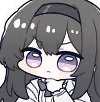
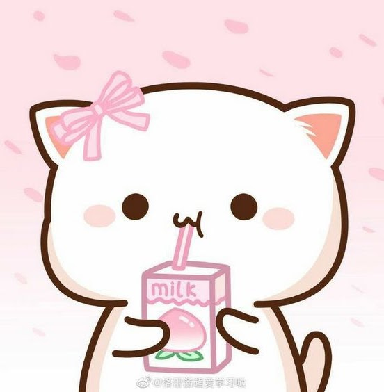
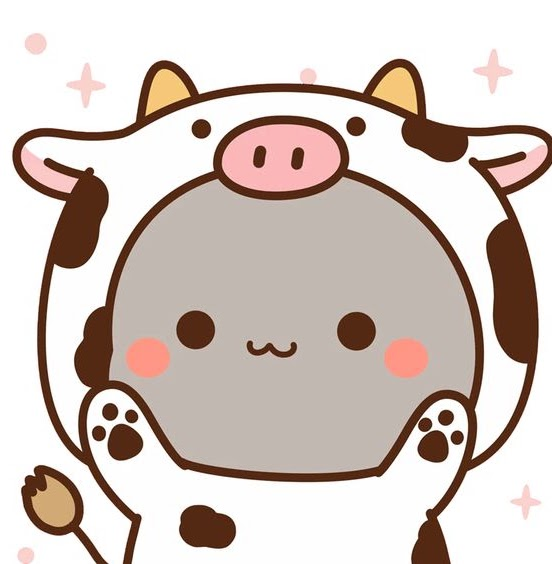
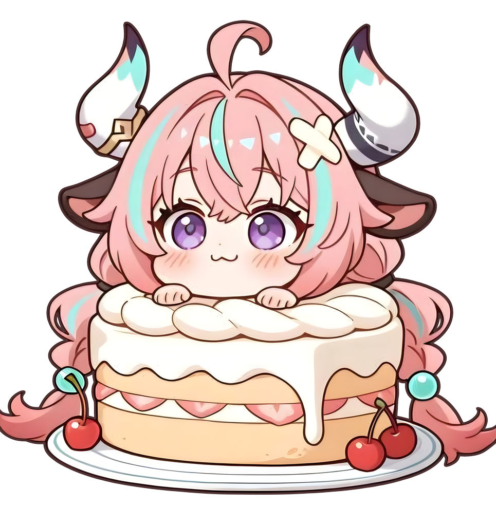
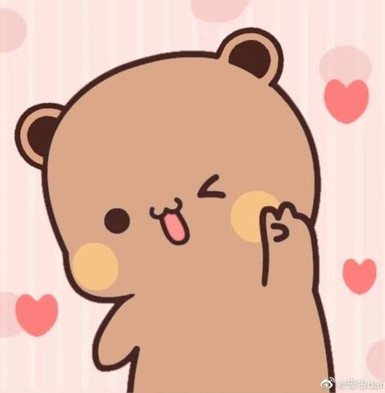
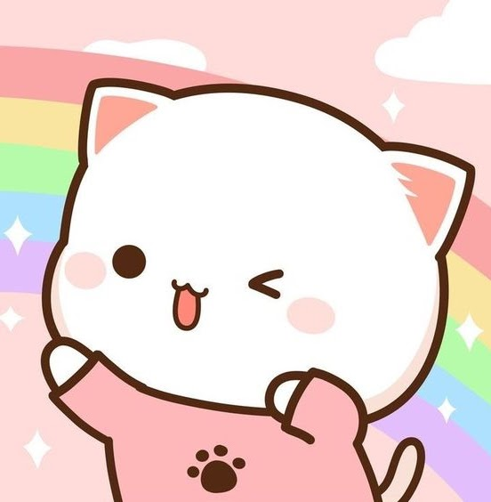
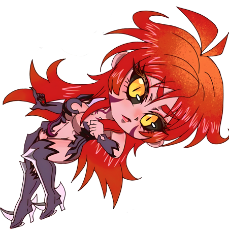

<!-- source: https://sites.google.com/view/real-tales-of-nymrathis/staff -->

## Meet the Staff

Both **Moderators** and **Storytellers** are here to make a fun and fair experience, while still working within the constraints of a text based West Marches. Their decision on rulings is final, and they will be treated with respect. They are your Dungeon Masters. If you need help, please use the right channels such as ⁠[❓-questions-and-help](https://discord.com/channels/1449914978927644807/1456129673179172954) and ⁠[🎫-submit-a-ticket](https://discordapp.com/channels/1449914978927644807/1456131236228759694). Do not demand immediate rulings and use the tools we have in place. Failure to respect the staff’s time or privacy will result in a warning.

**Under no circumstances are staff to be direct messaged about server issues.**

**Kei / Kei**  
**kei_jia**

**Fari / RiRi**  
**farifari**

**Sloth**  
**bombsquadsloth**

**Isa**  
**isa_minha**

**Drake**  
**drakesavage**

**Wock**  
**shudderwock**

**Mango**  
**mangochipotlehabanero**

**Crab**  
**crabmangaming**

**Async**  
**dev_sec_ops**

**Staff Applications: Open**

As our server grows, the need for more help around the backend has risen as well! To help facilitate the rise in our player base and help out the existing staff, we're posting this to remind folks that we are still accepting new people!

**Moderators** for making and enforcing both game and server rules, making game rulings, mediating player disputes, and assisting with general server mechanics and design.

**Storyteller** assist the staff and players by creating quests, server events, and running NPCs around the city. They are also welcome to assist with game rulings and light moderation but are under no expectation to do so.

**Developer** to help with the physical system or back-end of the server. Avrae aliases, snippets, or any errors with the channels themselves/technical aspects of the server. This is not for simple command help. Essentially the coding and aliasing part of Nymrathis.

**Quester** is for those who simply want to run a quest or two without having to commit to the other stuff. Your quests are looked at and approved by staff members. If you just want to be a Quester it's as easy as opening a ticket and chatting about what you plan on doing quest/story-wise.

If you are interested in being a Storyteller, Moderator or Bot Boss, please use the button below to open a ticket:

Apply now

[DnDBeyond](https://www.dndbeyond.com)
