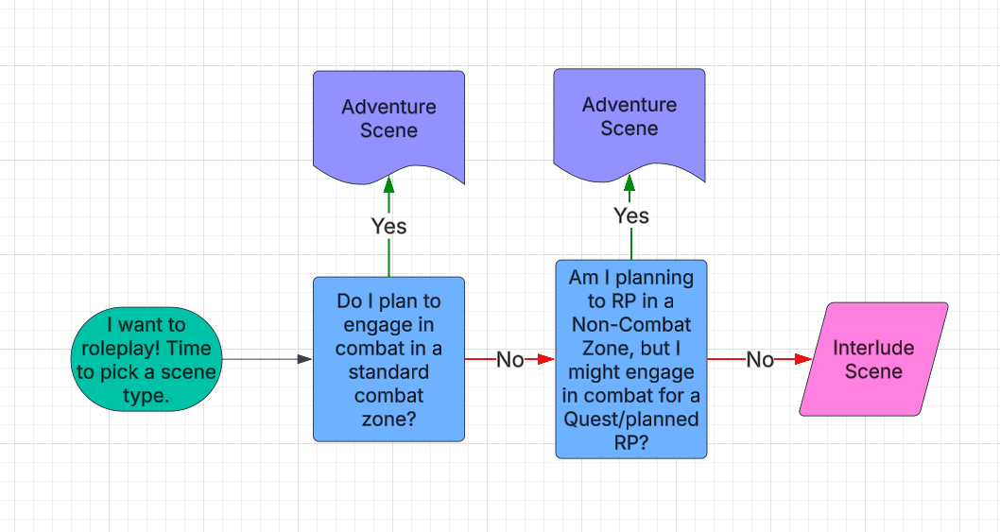

<!-- source: https://sites.google.com/view/real-tales-of-nymrathis/the-basics/how-to-play -->

# How to Play

[Introduction](#introduction)

[Game System](#game-system)

[How to Adventure](#how-to-adventure)

[How to RP (Roleplay)](#how-to-rp-roleplay)

[Keep in mind the following as you post:](#keep-in-mind-the-following-as-you-post)

[Erotic Roleplay (ERP)](#erotic-roleplay-erp)

[Zero Tolerance Sexual Violence Policy](#zero-tolerance-sexual-violence-policy)

[PC Pregnancy](#pc-pregnancy)

[Scene Limits](#scene-limits)

[💥An Adventure Scene is considered:](#an-adventure-scene-is-considered)

[🚩🏰 An Interlude Scene is considered:](#-an-interlude-scene-is-considered)

[🚪 Invite Only Scenes](#-invite-only-scenes)

[General Scene Rules](#general-scene-rules)

[NPCs](#npcs)

[Item Gifting](#item-gifting)

[Employment & Maximum Wage](#employment--maximum-wage)

[XP Farming/Post Spamming](#xp-farmingpost-spamming)

[Tupperbox Guidelines](#tupperbox-guidelines)

[Server Boost Rewards](#server-boost-rewards)

[DM XP Boost Role](#dm-xp-boost-role)

[DM Roles/Quester/Volunteer Monster Roles](#dm-rolesquestervolunteer-monster-roles)

[Starting Your Journey](#starting-your-journey)

## Introduction

This server is a D&D 5e living world West Marches game set in the city of Nymrathis on the island of Tlalocan. This server focuses on quality roleplay, creative storytelling, teamwork, and technical writing skill.

This is an overview of the basics of how our server works with tips on how to roleplay here!

## Game System

This server uses the Dungeons and Dragon 5th Edition system. Please familiarize yourself with the basic rules before playing. The server largely follows the rules as written, with a few adjustments to better suit a text-based living world format.

Some optional rules from the DMG are used here such as rules around resurrections and feats, as well as Tasha's Optional Rules. Should any questions arise over what rules are or aren't in place, please post your question on ⁠[❓-questions-and-help](https://discord.com/channels/1239236397672697987/1239341535527571566) or ⁠⁠[🎫-submit-a-ticket](https://discord.com/channels/1239236397672697987/1239341873873551370) for a more complicated question.

Homebrew rules or rulings that are server specific will be update in the general rules as often as possible, but will immediately be posted in [⁠](https://discord.com/channels/1019254075675652157/1024744337017426032)[📣-announcements](https://discord.com/channels/1239236397672697987/1239338730251096204) until they are officially added here.

## How to Adventure

This server is a player-driven West Marches style of play. Nymrathis is the main base of operations for players, though they may leave to explore the surrounding areas. Please ensure you are following the “Travel Rules'' pinned to each location thread. When departing into the wilds of Tlalocan, characters will always start at ⁠[〇⓪🟢verdant-expanse](https://discord.com/channels/1239236397672697987/1240811987911311370) except when venturing to another special location adjacent to the city. At each location channel in Tlalocan, a player (typically the one running encounters) will roll a D20 using the !r d20 command. The result of each number rolled is listed on the pinned post in each channel.

The encounter or event must be resolved before traveling to the next directional zone. Travel between each area is 1 hour of game time. If you elect to stay within the same thread and run multiple encounters, the time between each encounter is 20 minutes, except for special circumstances where the events of an encounter took even longer. This allows people to make multiple uses out of hour-long spells.

This is a living world, and while some events and encounters are run by the server staff such as Moderators and Storytellers, others are done collaboratively by the players. AKA: Anyone can run encounters! This means adventure and RP happens 24/7.

For more information on how to run encounters, read the Encounters, Combat, and Loot section.

## How to RP (Roleplay)

This server focuses largely on storytelling and creative writing. Keep that in mind with each post you make. While not everything written needs to be a masterpiece, it should be detailed enough to give a description of what your character is doing, feeling or saying. Your posts should give other players plenty to work with and play off of to create a dynamic story. Moreover, posts should use proper spelling and grammar, and must be written in English.

### Properly format your posts for maximum clarity using the following guidelines:

- *Description of actions in italics* Note: Using italics for action is not required, but is common practice in this server.
- "Dialogue in quotes."
- || Spoilers for whispers or information revealed via an insight check ||
- [Language] || "Spoilers and quotes for anything not said in common, with language indicated in brackets beforehand." ||
- (OOC chatter in brackets)

### Keep in mind the following as you post:

**One-liners are explicitly not allowed.**

They give nothing for other players to work with.

**Avoid double posting.**

XP is calculated by post length, and any posts less than 11 words (outside of combat channels) will be granted zero XP. Double, triple, etc posting will be seen as ‘spamming’ messages, so please consider editing your original post instead. Additionally, consistently double posting and adding new information can make formulating a response difficult for others as the groundwork is moving under them as they type.

**Do not make random observation posts if your character is not in a scene.**

Additionally, do not voice your character's thoughts as they sit inactive in a scene. Describe what your character is doing. Give people others something to work with. I.e. Two people are arguing in the square and your character is present. Avoid making posts that are simple: “Wow that’s crazy!” or “Joe sat there and watched.” Give us more!

**Make it clear if your character is entering or leaving a scene.**

If moving to another area of town please link the thread within your post. If you are leaving an area and logging off for the night, make a slight mention of it. You may also describe your character vaguely as “heading out” with no linked thread should you wish not to be followed or simply leave a scene without any follow-up.

**If your character was not described as present in a scene or location, they were not there.**

This avoids any issues with meta-knowledge or butting into scenes.

**If it wasn’t described, for the purposes of moderation, rulings, or other PC’s perception of an event: it did not happen.**

Obviously there is some leeway with this, misunderstandings can be clarified, retcons made, and events can be handwaved if agreed upon by all affected parties.

**Do not control other characters.**

Under no circumstances can you control another player character or DM-controlled NPC, this includes handwaved/force positioning (i.e. You cannot declare you were 100 ft away from a PC you were speaking face to face to, you cannot describe another PC touching your PC, etc)

**Do not force any RP or storyline on another player without their consent.**

If a player is uncomfortable with a storyline, or are not in the mood to engage in a certain type of RP (I.e. IC confrontation) they may bring this up with involved parties OOC. All players should respect this. That does not mean you can use this rule to avoid any and all confrontation. Your character’s actions have consequences, and confrontation is inevitable, but sometimes it just isn’t the right time. Any storyline that involves sensitive subjects will be cleared before being presented to the player.

**DMs may present unfavorable conditions, changes in the setting, or challenges directly to the characters as consequences for actions.**

Such setting vs character conflicts are exclusively under the control of the DM, and DMs will continually use safety tools to ensure these conflicts are engaging, and fun. However, you as a player must be open with your communication and concerns, and respect that your character's actions will have consequences. A DM should not be forcing a topic that is harmful or personally triggering, and will always discuss content warnings and “no-go” topics. Consequences are not punishment, and are complicated reactions to events or behavior that creates a living world and RP challenges. If you are uncomfortable with this, this server is not the right fit for you. Your actions will not exist in a vacuum.

**IC interactions or behaviors do not reflect the feelings or opinions of the player OOC.**

If there is any concern of bleeding over, please check with one another privately or in ⁠[⛑-safety-discussions](https://discord.com/channels/1239236397672697987/1239341621779108002), or open a support ticket to help settle any disputes or hurt feelings.

**Consent and player agency is key.**

Failure to respect consent or another player’s agency may result in a warning and in the case of repeated behaviour, a ban. Consent and agency applies to combat, romantic or sexual RP, or any sensitive topics. For more information read the PVP rules.

**Do not “chase” characters out of a scene in order to get the last word in.**

While you must give another player enough wiggle room to respond to your words and actions, if a character has left a scene, do not then add more dialogue to get the “last word in” or keep that character RPing within a channel. If the character has left, they’ve left.

## Erotic Roleplay (ERP)

Erotic Roleplay or ERP, while not banned, is not the focus of this server. That being said, please follow the guidelines we have in place to maintain a healthy and consenting environment.

All ERP must be kept to either private threads in homes or strongholds. All ERP in private rooms in Taverns and Inns should be kept strictly PG-13 and Fade to Black (FtB)! Explicit roleplay is not permitted in public settings or the wilds location channels.

Flirting, kissing, etc., is permitted in public settings but any PDA not appropriate in public in real life is not permitted in public settings or exploration location threads. When in doubt, feel free to take it to a private table thread or another appropriate area.

**‼️All ERP MUST be consented to both IC and OOC‼️**

No ERP with NPCs or Monsters is allowed.

### Zero Tolerance Sexual Violence Policy

Sexual violence is absolutely not acceptable on this server including but not limited to rape, pedophilia, snuff, or bestiality.

Any RP that depicts or implies this will result in an immediate ban.

### PC Pregnancy

1. Do NOT mention any sensitive pregnancy related manners in public chats and make sure you have full consent of your RP partners in private threads.

- Topics like miscarriage or pregnancy complications are EXTREMELY sensitive topics and should not be handled lightly. In fact, I'd warn away anyone who hasn't experienced these things first hand to stay away from the topic. That being said, writing can be therapeutic and we ask you use TWs and keep heavy conversations to private threads (invite only threads, not 🚪 private scenes) with people who have already consented to the topic.

1. No adventuring while pregnant

- Don't go out fighting monsters and dencing while your character is pregnant. It puts players, DMs, and staff in a weird position. Also kinda shitty pre-parenting to knowingly put your unborn baby at risk by adventuring. Just don't do it. You can temporarily move your character into the "Retired" character slot while they are pregnant. You can do some non-combat quest work to speed up your pregnancy. You can just fuck around the city until the baby pops out (don't feel a need to wait 9 months, but at least give it 3). There are lots of options available that staff can work with you on.

## Scene Limits

Your Character may be in three scenes. Only one of these scenes can be an adventure Scene.   
For clarification: you may have 1 adventure and 2 interlude scenes, or 3 interlude scenes.   
You can **never have:** More than 1 Adventure Scene or more than 3 Scenes total.

### 💥An Adventure Scene is considered:

- Any scene where you expect combat might happen!
- Frontier Categories as identified with the 💥 in their Category name, such as "💥 TLALOCAN" or "💥 NYMRATHIS UNDERCITY"
- Any combat Channel as identified with the 🔴, 🟠, or 🟢 danger ratings in their Channel name, or the for combat potential such as ⁠💥training-grounds
  - **INCLUDES:** Any combat channels, including combat channels in cities, such as ⁠🟢 The Endless Catacombs Nymrathis, ⁠☣☣🟠the-deep in Iria, or ⁠ⓤ⑤🟠obsidian-mines in Morg'khar
  - **EXCLUDES:** Frontier Strongholds such as ⁠🏰🐾the-sleeping-fox, which are Interlude Scenes. See below for more information.

### 🚩🏰 An Interlude Scene is considered:

- Scenes that are usually "non-combat" and are like interludes to the action and adventure, meant for character building RP!
- Most City Categories as identified with the in their Category name, such as " THE SUMMIT" or " IRIA"
  - **EXCLUDES:** Combat channels within cities, such as ⁠💥training-grounds and ⁠🟢 The Endless Catacombs in Nymrathis, ⁠☣☣🟠the-deep in Iria, or ⁠ⓤ⑤🟠obsidian-mines in Morg'khar
- Any Player Strongholds as identified with the in their Channel name, such as ⁠🏰🦊the-dancing-fox, ⁠🏰🦕the-tricera-stop, or ⁠🏰🌹bloodstone-orphanage
  - **INCLUDES:** Threads within Strongholds and Frontier located Strongholds, such as ⁠🏰🐾the-sleeping-fox

### 🚪 Invite Only Scenes

- Generally, these are always Interlude Scenes.
- Threads/Channels using the 🚪 emojis denote they are "Invite Only Scenes", meaning if the Thread/Channels is active, you cannot join without being invited!

### General Scene Rules

❗ **YOUR CHARACTER SHOULD NEVER BE IN THE SAME LOCATION TWICE** ❗

- AKA: Respect the timeline. If a character invites you to go hang out at the local tavern where your character is already in a scene with someone else, go to a different location. Duh.

❗ **YOUR CHARACTER SHOULD NEVER BE IN MORE THAN ONE COMBAT INITATIVE** ❗

- Sometimes combat does start in Interlude locations! If that is the case and you are currently in an Adventure scene, pause your Interlude scene until your character returns from the Frontier. After your Adventure scene is freed up, you can resume your Interlude scene. You cannot pick up another Adventure scene until the combat in your Interlude scene is resolved. This is to avoid your character ever being in more than 1 initiative or using game resources at the same time they are out adventuring.

If your character dies while on an adventure, you must finish up your Interlude scene before rolling for a new character or making plans for their resurrection.

- Additionally, you cannot impart meta knowledge on other characters following your death (i.e. where to find your body, etc).

Avoid timeline crossovers to the best of your abilities: AKA, avoid having your Interlude scenes in the ⁠⛲city-square at the same time your character is returning from the Frontier, as that is where characters come and go from Nymrathis to the Frontier.

**Below is an extremely simple Flowchart to figure out what kind of scene you are using. STILL READ THE INSTRUCTIONS, THIS IS JUST A TLDR EXAMPLE!!!**

## NPCs

NPC, not including monsters or random one-off characters in adventures and encounters or hirelings and minions, are exclusively under the control of the DMs. NPCs follow a vastly different set of rules in terms of capabilities and character interactions. They are not restricted by PvP rules, and may act as antagonists to your PCs. DM controlled NPCs may help or present unique challenges to your character. They may present consequences or rewards for your public actions. That being said, a DM will never use an NPC to harass or bully. Any issues with a DM controlled NPC can be brought up via ticket.

DMs may pre-plan the implementation of an NPC, or ‘cold drop’ them into the worlds to allow unique, spontaneous, and unpredictable story lines and engaging RP adding to the living aspect of Nymrathis.

## Item Gifting

To maintain balance and fairness within the server, the following gifting rules apply:

- Players of Levels 3–10 (Tier 1 and Tier 2) may receive no more than 2,000 gold per week or 1 Rare Item per week as a gift from anyone Level 11 or higher (Tier 3 and Tier 4).
- Please use !giftlimit to set up you character CC for tracking gifts. When you have reached your limit, remember to set up a /reminder remindme about:Name - Gift Limit Reset when:1w.
- Trading within your own Gift Limit groups (AKA Levels 3-10 vs Levels 11-20) faces no gifting limits.a
- Exceptions to this rule require approval from a Storyteller and are typically reserved for player-made quests or special circumstances.

## Employment & Maximum Wage

Many of you own business Strongholds, have groups of employees you manage, or occasionally need a one off task completed. Obviously you want to compensate those people! So we've set up guidelines for payment, that way you don't need to open a ticket every time you want to roleplay sending a lower level player down to the Black Market to get your Soothsalts.

This **mostly** pertains to Levels 11-20 employing the help of Levels 3-10. This is the maximum you can pay to anyone not within your normal Gifting Limits – but anyone within your limits you can pay whatever you want in addition as a "Tip".

- This is the **MAXIMUM** a player can receive for **1 player given task / 1 month of employment at a business**. You can always pay less. You cannot receive this payment multiple times a day by repeating a task.
- Employers, please record all payments in ⁠🔶-gift-spam with what the Employee did to earn said gold (can be as simple as regular wages or naming the task they performed). **Gold or Items received through Employment does not count against your Gift Limits**.
- This also counts the other way as the **maximum someone can charge for their services based on Tier**. For example, a T2 Cleric cannot charge more than 5,000 Gold to cast Raise Dead for another player, even if that other player is of a higher Tier. This prevents price gouging and keeps the exchange or gold for services reasonable. However. Players can always offer extra compensation as a "Tip". Tips are subjective to Gifting Limits.
- T1 - 2,000 GP or equivalent priced items based on their rarity
- T2 - 5,000 or equivalent priced items based on their rarity
- T3 - 10,000 or equivalent priced items based on their rarity
- T4 - 15,000 or equivalent priced items based on their rarity

Keep in mind that abuse of this system (T4s with infinite money giving a T2 5k gold every day to fold their laundry is not a worthy task of that money) will result in it being revoked.

## XP Farming/Post Spamming

XP Farming is considered making superfluous posts in order to gain more XP or engaging in unfair or bad-faith practices to earn more XP out of the bot. Post spamming is considered sending many short posts over a short period of time for no purpose other than to farm XP. Players found spamming or farming XP will receive a warning.

### Artificial Intelligence

ChatGPT and other AI tools can be a good resource for getting inspiration, generating random goblin names, or other helpful tasks. However, posts cannot rely on AI generated content. This is story telling, text based game and we want to play with people, not robots. Long winded posts, or walls of text that are generated using AI are not allowed.

## Tupperbox Guidelines

The use of Tupperbox is permitted, however you may only use it to RP your own characters. Anyone using a tupper alias to RP another character or an NPC that does not belong to them will be banned.

Ensure your tupper alias is properly named to avoid any confusion between what is a PC and what is a DM controlled NPC. Please set up your Tupper name in the same format as your username:

- Character Name [Level] Username

Additionally, if you are using a Tupper for your hirelings or minions you must indicate to whom the hireling belongs in their tupper name. Eg,

- John, Joe’s Hireling

If you are using a Tupper for narration, please indicate it is a PC narrating by adding [PC] at the end. Eg,

- Narrator [PC]

DMs will use Tuppers that do not have this formatting and will simply be the NPCs name or “Narrator” or “DM”. Using this formatting allows other players and moderators to see who is typing and avoid any miscommunication between PCs as DM NPCs follow a different set of rules.

## Server Boost Rewards

Boosting the server helps us keep our fun emojis and stickers, and we truly appreciate your support! While you are actively Boosting the server, you can gain access to a few rewards and perks!

- 1 Server Boost -> **Unlock a 5th Active Character Slot**
- Each Additional Boost -> Choose a **new server emoji**, which will be named in your honor

Additional Perks:

- A special **Server Booster Role**
- 1 PC can redeem their very own **Nymrathis Owl Familiar.** This familiar uses the Owl statblock, except its normally dull brown feathers are now a shiny purple! So cool! ✨ Only redeemable once. Tales of Nymrathis Staff are not liable for any damage done to your familiar, nor are they obligated to replace said familiar during its untimely demise.

Claim rewards by pinging @Moderator in ⁠[Rewards](https://discord.com/channels/1239236397672697987/1303557056095322214/1303557056095322214)

## DM XP Boost Role

When you take on the challenge of leading a game, you can now activate the XP Boost role to earn extra experience while running sessions. You can grab the role in [⁠❗roles](https://discord.com/channels/1239236397672697987/1239321103021768754/1352645081177391155) to toggle it on and off.

**How It Works:**

- Grants bonus XP while DMing or running a quest.
- Available for any player who is actively running a quest, dencs, or Hoard.
- Must be used responsibly—misuse can result in strikes or removal for the entire server.
- Players using the XP Boost will have a ⚡ emoji next to their name and turn yellow!

**Rules for Using XP Boost:**

- You must be DMing or running a quest for at least 2 players (which can include yourself).
- While the role is active, you cannot participate in other RP—this boost is only for DMs actively running content. Feel free to toggle the role off and on when you want to make a reply outside of your DMing.
- Be diligent! You must remove the XP Boost role when you are not actively DMing. Abuse of this role will result in strikes, and if necessary, the feature may be removed for everyone.
- Players, please help keep each other in check! If you see someone has forgotten to turn off their role, please remind them or open a staff ticket to let a moderator know.

I will stress: Abuse of this role will mean we remove it from the **ENTIRE** server. Be on your best behavior.

## DM Roles/Quester/Volunteer Monster Roles

Apply for DM/Volunteer Monster roles via the Submit a Ticket channel. Promoting is still up to **staff review** even if all criteria is met!

**@Veteran DM**

- Reliable with both DnD and server rules
- Make very few mistakes
- Eligible for the Volunteer Monster role
- Allowed to Solo

**@Trusted DM**

- Know the DnD rules and most of the sever rules
- Occasionally makes mistakes
- Eligible for the Volunteer Monster role
- Allowed to Solo

**@Newbie DM**

- New to the Server rules and/or DnD rules
- The baseline where everyone starts
- No soloing

**Trusted to Veteran Promotion:**

They must provide at least 8 combat outings they have run, which must include at least 3 different hoards.

**Newbie to Trusted Promotion**

They must provide at least 5 combat outings they have run, which must include at least 2 different hoards.

**@Volunteer Monster**

This is a pingable Role that allows players to find a volunteer DM.

Volunteer Monsters now earn rewards for teaching new players how to DM

- For each outing a VM supervises, earn 1 Downtime Day and 5 Renown** towards any Faction (Not doubled by Rank. Cannot be Universal Renown).
- An "outing" must consist of at least 7 combat dencs OR 3 combat dencs and 1 hoard.
- VM are expected to be watching these combats, piping in wirh advice, assuring combats are being run correctly, helping with commands, and taking over DMing when necessary.
- VM are welcome to join these outings with their own characters if they like, or can simply spectate.
- VM can request approval for rewards in ⁠Rewards by pinging @Moderator

**Staff DM Roles**

Staff members must be at least Trusted DM level.

**Quester DM Roles**

Questers can start as Newbie DM but all their quests must be supervised by a Veteran DM. Trusted DMs do not need supervision during the running of their quests. All Questers still need their quests approved via the ⁠📝quest-corner

## Starting Your Journey

To set up your character, follow the guideline set out in ⁠⁠[📗-character-creation.](https://discord.com/channels/1239236397672697987/1239335034272616529) Once that's done, you can join in on the fun!

Most characters start their journey arriving in the [⤷⤏city-square](https://discord.com/channels/1239236397672697987/1240315870107009147) or arriving via [⤷⤏nymrathis-overlook](https://discord.com/channels/1239236397672697987/1241881574270697583). Please ensure you follow the travel rules or location restrictions, all of which are outlined in the pinned posts on each thread. Any questions can be brought to staff at any time

[DnDBeyond](https://www.dndbeyond.com)
